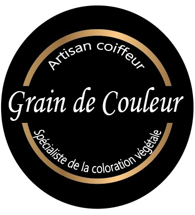

# Cahier des Charges

## Création du site internet pour le Salon de Coiffure Grain De Couleur

Grain de Couleur est un salon de coiffure mixte composé d'une équipe de trois personnes ; Cyrille, Amandine et Manon. Ouvert depuis une dizaine d'année du mardi au samedi, la PME a su se différencier des autres salons de coiffure grâce aux colorations végétales. Le bien être des client.e.s est primordiale pour l'entreprise ainsi que celui de la planète. Pour plus d'informations ous pouvez dorénavant les retrouver sur [Facebook](https://www.facebook.com/profile.php?id=100063516872842), et aussi [Instagram](https://www.instagram.com/graindecouleur_/).

Après les réseaux sociaux créer il y a un an et demi pour l'entreprise Grain de Couleur il est tant de se mettre à la page et de créer son propre site internet et vivre avec son temps. 

## Description du projet

Le site internet va posséder la caractéristique d'un site e-commerce, plusieurs options sont attendues ; 
* Créer un compte pour les clients,
* Se connecter, 
* Pouvoir prendre leur rendez-vous eux même ou les annuler,
* Observer les différentes prestations avec les tarifs, les sélectionner et les ajouter au panier
* Acheter leurs produits, 
* Recevoir un message la veille d'un rendez-vous
* Acheter des cartes cadeaux
* Création d'un programme de fidéliter
* Les horaires, la map
* Les réseaux sociaux

Lors du démarrage du site web, c'est ce que nous attendons principalement. Par la suite pourquoi pas créer une fonctionnalité blog ou tuto afin d'y mettre des conseilles, des témoignages des clients, une boite à idée. 

## Objectifs du projet

Dans un premier temps le site e-commerce permetrrait de faire gagner du temps à l'équipe car elle ne serait plus obligé de perdre du temps sur les prises de rendez-vous. Mais aussi de faire plus de vente de produits, de toucher une génération plus jeune. Et enfin donner aux clients le sentiments de faire parti d'une communauté avec les valeurs du bien-être, de l'écologie et de la fidéliser encore plus. 

## Présentation visuelle 

 - Le visuel devra respecter la charte graphique du logo et les textes. 

- La présentation de l'entreprise et de l'équipe
- Le lien pour pouvoir créer un compte et/ou se connecter
- Les différentes prestations proposées
- un agenda pour pouvoir prendre rendez-vous avec les différentes prestations
- Les produits proposés à la vente
- La possibilités à acheter des cartes cadeaux
- L'apparition du programme de fidélité
- Une map pour voir l'emplacement du salon de coiffure
- les logos des réseaux sociaux avec un lien en cliquant dessus

## Fonctionnalité pour le client

Le ou la client.e va tout d'abord passer par la création d'un compte client avec le prénom, le nom, la date de naissance, l'adresse email, le numéro de téléphone afin de créer une base de données. 
Ensuite il/elle va pouvoir naviger sur le site e-commerce afin de choisir la prestation qu'il/elle souhaite afin de prendre rendez-vous par la suite. 
Utiliser un moyens de paiement en ligne ou cocher le règlement en boutique.
Et puis recevoir un message la veille du rendez-vous pour ne pas êre face à des oublis.

## Fonctionnalité par l'entreprise

Lors des inscriptions effectués par les clients, l'entreprises va pouvoir collecter les données de ceux-ci avec leurs accords. Dans l'objectif de créer une base de données. 
Celle-ci permettra d'envoyé des avantages lors des anniversaires ou bien même avec le programme de fidélité mais encore des messages de rappels de rendez-vous...
